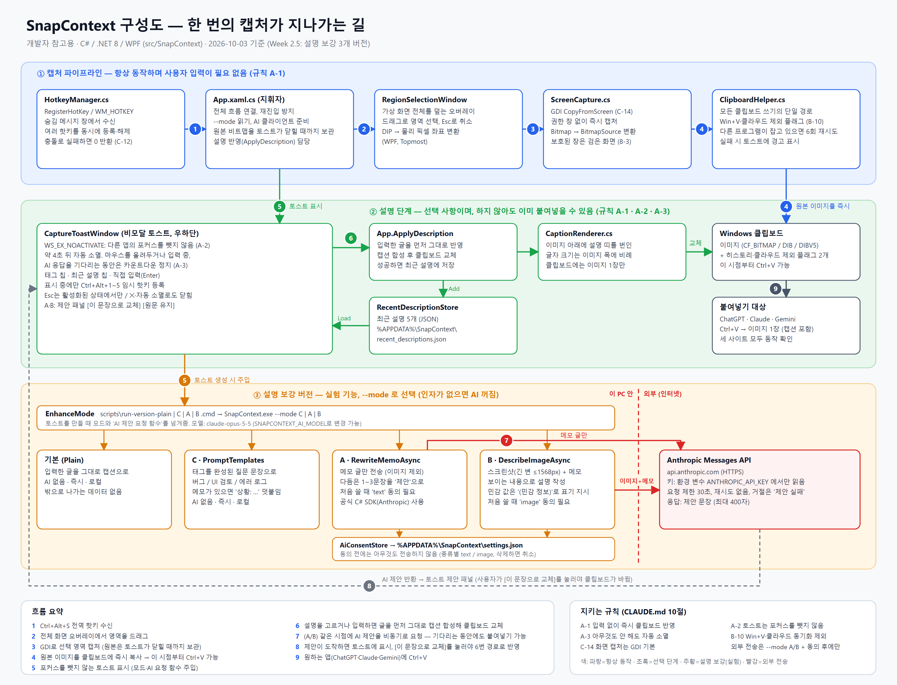

# SnapContext 진행 로그

> 이 파일은 세션 간/기기 간 작업 연속성을 위한 살아있는 로그입니다. 안정적인 스펙·규칙은 [CLAUDE.md](CLAUDE.md)에 있고, 이 파일은 "지금까지 뭘 했고 다음에 뭘 할지"를 추적합니다. 새 기기에서 Claude Code를 열면 CLAUDE.md가 자동 로드되지만, 이 파일은 자동 로드되지 않으니 새 세션에서 반드시 먼저 읽고 이어서 진행하세요.

## 개발 구상도 (개발자 참고용)


한 번의 캡처가 지나가는 경로, 파일별 역할, 지키는 규칙, 외부로 데이터가 나가는 경계를 한 장에 그렸다. 편집 가능한 원본은 [docs/architecture.svg](docs/architecture.svg)이며, 구조가 바뀌면 이 그림도 함께 고칠 것.

## 확정된 결정
- 배포 범위: 공개 배포(일반 대중/상업화) 확정 (2026-09-20). 상세는 [CLAUDE.md 12절](CLAUDE.md) 참고.
- Phase 1 설명 전달 기본값: **캡션 합성**(이미지에 텍스트 번인) 확정, "동시 붙여넣기 자동 병합"은 채택 안 함 (2026-09-27). 상세는 [CLAUDE.md 12절](CLAUDE.md) 참고.

## 현재 단계: Week 1 PoC — LLM 붙여넣기 실동작 검증 (규칙 D-15)

CLAUDE.md 규칙 15("Week 1에 ChatGPT/Claude/Gemini 각각에서 이미지+텍스트 붙여넣기 실동작을 먼저 검증")를 진행 중.

### 테스트 방법
`research/week1-paste-test/`의 PowerShell 스크립트로, 향후 WPF 앱이 `Clipboard.SetDataObject`로 만들 클립보드 상태(이미지+텍스트 동시)를 재현한 뒤, 실제 웹사이트 채팅창에 Ctrl+V 한 번으로 무엇이 붙는지 관찰.

- `set_test_clipboard_v1.ps1`: `DataObject.SetData(DataFormats.Bitmap, ...)` + `SetData(DataFormats.UnicodeText, ...)` 방식
- `set_test_clipboard_v2.ps1`: `DataObject.SetImage(...)` + `SetText(...)` 전용 메서드 방식 (v1이 이미지 미인식 문제일 경우를 대비한 재시도)

### 결과 (2026-09-24 기준)

| 사이트 | 스크립트 | 결과 |
|---|---|---|
| ChatGPT | v1 (SetData 방식) | 텍스트만 붙음, 이미지 미첨부 |
| ChatGPT | v2 (SetImage/SetText 방식) | 텍스트만 붙음, 이미지 미첨부 (v1과 동일) |
| Claude | - | 미실시 |
| Gemini | - | 미실시 |

### 결론 (2026-09-27)
ChatGPT 실측 결과(2회, 서로 다른 클립보드 구성 방식) 모두 텍스트만 붙고 이미지가 탈락 → "이미지+텍스트 동시 붙여넣기"는 채택하지 않기로 결정. **Phase 1 기본값을 "캡션 합성"으로 확정**(CLAUDE.md 3절/규칙 D-15/12절 참고). 대조군 테스트(이미지 단독)와 Claude/Gemini 개별 검증은 이 결정에 필수 전제가 아니라고 판단해 진행하지 않음 — 캡션 합성은 클립보드에 이미지 포맷 하나만 올리므로 사이트별 paste 구현 차이와 무관하게 동작하기 때문.

## Week 1 PoC 코드: 전역 핫키 + 영역 캡처 + 클립보드 (2026-10-03 사용자 실기 테스트 통과)

`src/SnapContext/` (C# / .NET 8 / WPF). Ctrl+Alt+S → 가상 화면 전체 오버레이에서 드래그 선택 → GDI `CopyFromScreen` 캡처 → `Clipboard.SetImage` 즉시 반영 → 우측 하단에 포커스를 뺏지 않는 "캡처 완료" 알림이 2.5초 후 자동 소멸.

사용자 실기 테스트 결과(전부 정상): 핫키 동작, 오버레이/십자 커서, 드래그 박스, 완료 알림 자동 소멸, 붙여넣기 시 선택 영역과 캡처 결과 일치, Esc 취소.

### 구성
- `HotkeyManager.cs`: `RegisterHotKey` P/Invoke, 숨김 메시지 윈도우의 `WM_HOTKEY` 수신. 여러 핫키를 동시에 등록/해제하며, 등록 실패는 반환값(0)으로 감지.
- `ScreenCapture.cs`: GDI BitBlt 캡처(규칙 C-14) + `BitmapSource` 변환.
- `RegionSelectionWindow.xaml(.cs)`: 영역 선택 오버레이. DIP → 물리 픽셀 변환 포함.
- `App.xaml.cs`: 전체 흐름 연결. `StartupUri` 없이 `OnExplicitShutdown`으로 창 없이 상주. 캡처 중 재진입 방지.
- (Week 2) `CaptureToastWindow.xaml(.cs)`: 캡처 직후 우하단 비모달 토스트. 태그 칩, 최근 설명 칩, 직접 입력창.
- (Week 2) `CaptionRenderer.cs`: 이미지 하단에 설명을 캡션으로 번인한 새 이미지 생성(1차 안).
- (Week 2) `ClipboardHelper.cs`: 모든 클립보드 쓰기의 단일 경로. B-10 제외 플래그 적용 + 잠금 시 재시도.
- (Week 2) `RecentDescriptionStore.cs`: 최근 설명 5개를 `%APPDATA%\SnapContext\recent_descriptions.json`에 보관.

### 빌드/실행 (다른 로컬에서 재현 시)
```powershell
winget install Microsoft.DotNet.SDK.8
dotnet build src/SnapContext/SnapContext.csproj
src/SnapContext/bin/Debug/net8.0-windows/SnapContext.exe
```
트레이 아이콘이 아직 없어서 종료는 작업 관리자(또는 `Stop-Process -Name SnapContext`)로 해야 함.

## Week 2: 설명 토스트 (2026-10-03 구현, 자동 검증 통과 / 실기 테스트 대기)

캡처 직후 클립보드에 원본 이미지를 먼저 올리고(A-1), 우하단에 포커스를 뺏지 않는 토스트를 띄운다. 설명을 고르거나 입력하면 캡션을 번인한 이미지로 클립보드를 **교체**한다. 아무것도 안 하면 약 4초 뒤 자동으로 사라지고 원본 이미지가 그대로 남는다.

### 동작 요약
- 토스트는 `WS_EX_NOACTIVATE`로 떠서 표시 중/칩 클릭 시 다른 앱의 포커스를 뺏지 않음. **입력창을 직접 클릭했을 때만** 활성화되어 타이핑 가능.
- 태그 칩(버그 / UI 검토 / 에러 로그)과 최근 설명 칩(최대 5개)은 클릭 즉시 반영. 태그를 누를 때 입력창에 글이 있으면 `태그: 입력` 형태로 반영.
- 최근 설명은 Ctrl+Alt+1~5로도 반영(토스트가 떠 있는 동안에만 등록, 닫히면 해제).
- 마우스를 올려두거나 입력창에 포커스가 있으면 카운트다운 정지. 입력창에 글을 쓴 채 다른 곳을 클릭해 비활성화되면 그 글을 반영하고 닫음.
- 반영/실패 결과를 토스트에 잠깐 표시. 반영 실패 시 원본 이미지는 클립보드에 그대로 있음.
- 클립보드 쓰기는 전부 `ClipboardHelper`를 거치며 `CanIncludeInClipboardHistory`/`CanUploadToCloudClipboard`=0 플래그가 항상 붙음(규칙 B-10). 다른 프로세스가 클립보드를 잡고 있으면 6회 재시도.

### 자동 검증 결과 (임시 하니스, 38개 항목 전부 통과)
캡션 합성(폭 유지, 원본 픽셀 보존, 좁은 이미지, 4K 처리 18ms), 클립보드(이미지 + 두 제외 플래그가 DWORD 0으로 존재, 이미지 복원), 최근 설명 저장소(5개 유지, 중복 이동, 한글 저장, 손상 파일 복구), 토스트(포커스 미탈취, NOACTIVATE, 칩 클릭, 입력+Enter, 태그+입력, Esc, 약 4초 자동 소멸, 복사 실패/반영 실패 표시), Ctrl+Alt+2 전역 핫키 동작과 해제.

### 사용자 실기 테스트 결과 (2026-10-03)
- 한글 IME로 입력한 뒤 **Enter 한 번**으로 반영됨(두 번 필요하지 않음).
- 마우스를 토스트 위에 올려두면 사라지지 않음.
- Win+V(클립보드 기록을 켠 상태): Win+Shift+S로 복사한 이미지는 기록에 남고, **SnapContext 캡처는 남지 않음** → 규칙 B-10 동작 확인.
- 붙여넣기: 처음에는 "동작하지 않는다"고 보고되었으나 원인을 특정하지 못했고, 이후 사용자가 캡션 띠가 포함된 이미지가 정상적으로 붙는 것을 확인함. 이어서 사용자가 ChatGPT / Claude / Gemini 세 사이트 모두에서 동일하게 붙는 것을 확인함.

### 자동 붙여넣기 검증 (Chromium 계열 Edge, 2026-10-03)
Edge 창에 실제 Ctrl+V를 보내는 테스트 페이지로 확인(임시 스크립트, 저장소 미포함). 클립보드 쓰기 4가지 방식(Week 1 `Clipboard.SetImage`, 현재 `ClipboardHelper`, 플래그 없는 `SetDataObject`, 캡션 합성) **모두 `image/png` 파일 1개로 인식**됨. 실제 앱을 가상 핫키·마우스 드래그로 구동했을 때도 캡처만 한 경우 300x200, 캡션 반영(Ctrl+Alt+1) 시 300x245 이미지가 정상으로 붙음. 클립보드에 올라가는 형식은 `CF_BITMAP`/`CF_DIB`/`CF_DIBV5`와 제외 플래그 두 개.
- 이로써 1주차에 미뤄 둔 "이미지 단독 붙여넣기" 대조군이 Chromium에서 확인됨(다만 ChatGPT/Claude/Gemini 사이트 자체의 동작은 별개).
- 첫 자동 실행에서만 예상과 다른 크기(2729x313)의 이미지가 한 번 붙었고, 워밍업 후 재실행에서는 재현되지 않음. 첫 캡처 시 드래그 타이밍이 어긋났거나 사용자가 그 사이 따로 복사한 이미지였을 가능성이 있으나 확정하지 못함.

### 아직 사람이 확인해야 하는 것
- 이 PC의 화면 배율이 100%가 아닌 환경과 모니터 2대 환경에서 캡처 영역이 정확한지.

### 알려진 한계
- 핫키는 Ctrl+Alt+S 고정. 등록 실패 시 MessageBox만 표시. **규칙 C-12상 재설정 UI/대체 키 제안 없이는 출시 불가.**
- **Esc는 토스트가 활성화된 상태(입력창 클릭 후)에서만 닫힘.** 비활성 상태에서는 ✕ 버튼 또는 자동 소멸. 규칙 A-3의 "Esc 즉시 닫기"와 차이가 있어 CLAUDE.md 12절에 잠정 결정으로 기록함.
- 숫자키는 맨 숫자 대신 Ctrl+Alt+1~5 (CLAUDE.md 12절 참고).
- 캡션 디자인은 1차 안(어두운 띠 + 흰 글씨 + 파란 선, 글자 크기는 폭에 비례). GDI+가 한글을 글자 단위로 줄바꿈해 어절 중간에서 끊길 수 있음.
- 설명 최대 200자.
- 파일 저장/파일명 생성은 아직 없음(CLAUDE.md 11절 시퀀스 확정 후 구현). 캡처는 지금 클립보드에만 존재.
- 토스트는 주 모니터 우하단에만 뜸(캡처한 모니터와 다를 수 있음).
- DPI는 System DPI Aware 기준. 모니터별 배율이 다른 멀티 모니터는 오차 가능성이 있어 PMv2 전환 시 재검증 필요.
- 실기 테스트는 사용자 PC 1대 기준이며, 이 PC의 화면 배율은 기록하지 않았음.
- 설명 텍스트는 `%APPDATA%\SnapContext\recent_descriptions.json`에 평문으로 저장됨(개인정보가 들어갈 수 있으므로 설정 화면의 "기록 지우기"를 Week 4에 고려).

### 다음에 이어서 할 일
1. 캡션 디자인에 대한 사용자 피드백 확인, 토스트 Esc 동작(CLAUDE.md 12절 잠정 결정)에 대한 사용자 결정 받기.
1-1. 설명 보강 3개 버전(C/A/B)을 사용자가 테스트한 뒤, 출시에 넣을 버전과 기본 동작을 결정한다(위 "Week 2.5" 참고).
2. 저장/파일명 시퀀스 확정(CLAUDE.md 11절): 타임스탬프 임시 파일명으로 즉시 저장 후 설명 입력 시 rename. 캡처를 디스크에 저장할지 자체가 사용자 결정 사항(개인정보).
3. 캡션 디자인 피드백 반영, "순차 붙여넣기"용 "설명 복사" 단축키/버튼(Week 3).
4. 핫키 재설정 UI와 설정 화면, 트레이 상주(Week 4).
5. 코드사이닝 인증서 비용/신청 조건 재확인(CLAUDE.md 11절 미해결 항목).

## Week 2.5: 설명 보강 3개 버전 비교 (2026-10-03 구현, 자동 검증 통과 / 사용자 테스트 대기)

사용자가 "입력한 글 그대로가 아니라 AI가 더 완성도 있게 만들어 주길 원할 것"이라고 제안했고, 세 방식을 **버전별로 만들어 비교 테스트**하고 싶다고 요청해 모두 구현했다. 실행할 때 `--mode`로 고르며, 인자가 없으면 AI는 꺼져 있다. **어떤 버전을 출시에 넣을지는 테스트 후 결정**(CLAUDE.md 11·12절).

### 버전과 실행 (`scripts\`의 .cmd를 더블클릭, 실행 중인 SnapContext는 자동 종료 후 교체)
| 버전 | 파일 | 동작 | 밖으로 나가는 데이터 |
|---|---|---|---|
| 기본 | `run-version-plain.cmd` | 입력한 글을 그대로 캡션으로 | 없음 |
| C | `run-version-C.cmd` | 태그를 누르면 완성된 질문 문장이 캡션이 됨(메모가 있으면 `상황: 메모`로 덧붙임) | 없음 |
| A | `run-version-A.cmd` | 입력한 메모를 AI가 다듬은 문장을 **제안**으로 보여줌 | 메모 글만 Anthropic API로 |
| B | `run-version-B.cmd` | ✨ 버튼 또는 설명 적용 시 AI가 스크린샷(+메모)을 보고 설명을 써서 **제안** | 스크린샷(긴 변 1568px 이하로 축소)과 메모를 Anthropic API로 |

A/B를 쓰려면 (C와 기본은 필요 없음)
1. console.anthropic.com에서 API 키를 발급한다. Claude 구독과는 별개이며 API 사용량은 따로 과금된다. **키는 채팅에 붙여넣지 말 것.**
2. 사용자 환경 변수로 등록한다: `setx ANTHROPIC_API_KEY "발급받은키"` 후 새로 실행한다(A/B 실행 파일이 키가 없으면 경고를 띄움).
3. 모델은 기본 `claude-opus-5-5`(낮은 effort). 속도/비용을 비교하려면 `setx SNAPCONTEXT_AI_MODEL claude-haiku-4-5`처럼 바꿀 수 있다.
4. 처음 AI를 쓸 때 "AI 전송 동의" 창이 뜬다(메모만/이미지 포함은 따로 동의). 동의는 `%APPDATA%\SnapContext\settings.json`에 저장되며 지우면 취소된다.

### AI 버전의 공통 동작 원칙
- 캡처 직후 원본이 이미 클립보드에 있다(A-1). 설명을 적용하면 입력한 글이 **먼저 그대로** 반영되어 바로 붙여넣을 수 있고, AI 제안은 뒤따라 도착한다. **"이 문장으로 교체"를 눌러야 클립보드가 바뀐다**(붙여넣는 도중 내용이 바뀌는 사고 방지). "원문 유지"를 누르면 그대로 닫힌다.
- AI 응답을 기다리는 동안 토스트가 사라지지 않는다(요청 제한 30초). 응답이 오면 10초 안에 고르면 되고, ✕/Esc로 닫으면 요청이 취소된다.
- 키 없음, 401, 한도 초과, 서비스 오류, 연결 실패, 시간 초과, 거절, 빈 응답은 사유를 보여주고 입력한 글은 그대로 유지한다.
- 데이터 반출은 버전을 명시해 실행한 경우에만, 처음 쓸 때 종류별 동의를 받은 뒤에만 일어난다. API 키는 환경 변수에서만 읽고 저장/로그하지 않는다. `SNAPCONTEXT_AI_BASE_URL`(테스트용)은 localhost만 받아들인다.
- Claude 공식 C# SDK(`Anthropic` 12.53.0)를 사용한다.

### 자동 검증 (임시 하니스 104개 전부 통과)
실제 Anthropic 서버는 호출하지 않았고, 로컬 스텁 서버로 확인했다. 요청 경로/키 헤더/모델/effort/시스템 프롬프트, A는 메모만 전송되고 이미지가 없음, B는 base64 이미지(4K → 1568x882로 축소)와 메모 포함, Haiku 계열은 effort 미전송, 401/429/500/거절/빈 응답/긴 응답 자르기/시간 초과/취소/연결 불가 처리. 토스트는 C 템플릿, A·B의 즉시 반영 → 제안 도착 → 교체/유지/오류/취소/빈 메모, 응답 대기 중 사라지지 않음, 기본 버전에서는 AI 요청이 없음. 동의 저장소, 모드 파싱도 확인했다.

### 사용자가 버전별로 확인할 것
- **C**: 태그만 눌렀을 때와 메모를 쓰고 태그를 눌렀을 때 문장이 자연스러운지, 그 이미지를 AI에 붙여넣으면 원하는 답이 나오는지.
- **A**: 짧은 메모(예: "로그인 에러")를 적용했을 때 제안이 의도를 왜곡하지 않는지, 응답 시간, 교체/원문 유지 동작, 키가 없을 때의 안내.
- **B**: 메모 없이 ✨만 눌렀을 때와 메모+✨ 모두에서 설명 품질, **화면에 없는 내용을 지어내지 않는지**, 비밀번호 같은 값을 마스킹하는지, 응답 시간.
- 공통: 가장 쓸 만한 버전과, 기본으로 켤 버전.

### 알려진 한계와 위험
- 실제 API 동작은 사용자 키로만 확인할 수 있다(스텁 서버 검증은 요청 형식과 오류 처리까지).
- **B는 캡처한 화면이 외부 서버로 나간다.** 모델에게 민감한 값을 옮겨 적지 말라고 지시하지만, 전송 전에 로컬에서 가리지는 않는다. 출시하려면 Phase 2 자동 블러 같은 전송 전 마스킹이 선행되어야 한다.
- 공개 배포 시 API 키와 비용을 누가 부담할지(사용자 키 vs 자체 서버), 개인정보 안내, 화면 캡처와 네트워크 전송 조합의 백신 오탐(8-4절)을 다시 검토해야 한다.
- 거절(refusal) 응답은 서버 측 폴백 없이 "제안 실패"로 처리한다. 재시도는 하지 않는다. 호출당 비용이 발생한다(사용량은 Anthropic 콘솔에서 확인).
- 응답을 기다리는 동안에는 입력 UI가 숨겨진다.

### 환경 관련 주의사항 (다른 로컬에서 재현 시 필독)
- **Windows PowerShell 5.1은 BOM 없는 UTF-8 `.ps1` 파일의 한글을 깨뜨림.** 시스템 기본 코드페이지로 오인식해서 문자열이 깨진 채로 실행됨(콘솔 출력뿐 아니라 실제 문자열 데이터 자체가 손상됨). 한글이 포함된 스크립트는 반드시 UTF-8 **BOM 포함**으로 저장할 것. 확인/수정 방법:
  ```powershell
  $content = Get-Content -Path <파일경로> -Raw -Encoding UTF8
  Set-Content -Path <파일경로> -Value $content -Encoding UTF8   # Windows PowerShell 5.1에서 BOM 포함으로 저장됨
  ```
- 테스트 시 클립보드에 올린 더미 이미지/텍스트는 실제 개인정보가 아닌 합성 테스트 데이터임.
- 사이트에 붙여넣기 후 **전송(Send) 버튼은 누르지 않는 것**이 원칙(관찰만 목적). 실수로 전송해도 더미 데이터라 문제는 없음.
